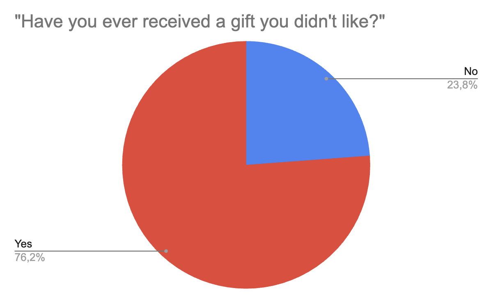
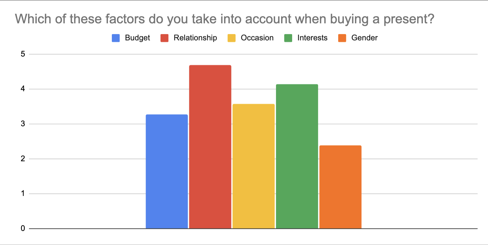

# Week 4 & 5

In the fourth and fifth week, we started to implement other requirements engineering techniques such as surveying and prototyping. We also started to start stakeholder interviews to better understand the users problems and how we could find a solution for them. Based on the interview and survey results, I could do a personal experiment with Guillermo by comparing the information of both techniques. Furthermore, we digged deeper into the psychological aspects of gift giving by reading the book "The Psychology of Gift Giving" by Bernd Stauss.

## Case Work (12 hours)

### Stakeholder Interviews

After we prepared the questions for the stakeholder interviews in the last week, we started to conduct the interviews with potential users of the system.
Each of the team members conducted interviews with several people from friends and family who are from different nationality, age group and background. We collected interview answers from around 50 people and analyzed the data to get a better understanding of the user needs.

#### General Insights

Many interviewees expressed that they enjoy the experience of giving gifts, but they often encounter challenges when it comes to selecting the right ones, particularly for individuals with diverse interests or for those they do not know well.

When considering gift options, common factors that interviewees take into account include the recipient's interests, the nature of their relationship, the occasion for the gift, and their budget. While some individuals consider gender in their selection process, others do not find it to be a crucial factor.

Regarding app usage, a significant number of interviewees expressed interest in using an application that provides personalized gift suggestions, especially during important events such as birthdays and holidays. Privacy emerged as a concern for some users, while others felt comfortable sharing gift ideas publicly.

#### Preferences for App Features

Interviewees prefer apps that offer multiple gift options along with links for purchasing these gifts. They value inspiration and creative ideas more than direct purchase links. Additionally, when choosing gifts, they tend to favor practical and thoughtful options. Some interviewees are open to seeing advertisements if the app is free, while others would be willing to pay a small fee for a well-functioning application. Although the uniqueness of gifts is important, interviewees often prioritize the likability of the gifts.

#### Common Interests of Interviewees

Most interviewees showed a strong interest in receiving personalized gift suggestions and preferred to have multiple options presented to them rather than a single recommendation. Many emphasized the importance of privacy, expressing a desire to keep their gift choices and history confidential. Practicality and thoughtfulness were also highly valued traits in gift selections. It was noted that the app would primarily be used during key events like birthdays and holidays. Finally, interviewees favored receiving inspiration and ideas over direct links to purchase gifts.

### Survey

To further increase the sample size the team also started to prepare a survey that we could send to a larger group of people. The survey was prepared with the same questions as the interviews and was sent to a group of about 50 people. We could find some statistical insights from the survey that helped us to understand the user needs better.

For example, we could confirm that most people received a gift before that they didn't like. This confirms the need for a system that helps to find the right present for someone.

Another insight from the survey was that relationship and interests were the major factors when choosing a gift. In contrast, gender plays a minor role in the decision-making process.

#### Disadvantages of Surveys

While survey taking has advantages such as reaching a larger audience and collecting quantitative data, it also has some disadvantages. For example, the survey results can be biased or mislead by the way the questions are formulated. Schuman, H., & Presser [1] explores how the framing of questions can influence respondents' answers and overall survey effectiveness. For example, we used an absolute scale for the question for determining the importance of factors when buying gifts. Each respondent had to rate the importance of each factor on a scale from 1 to 5, although there were no clear definitions of what each number meant. This could lead to different interpretations of the scale and thus to biased results.

Also, the quality of the data can suffer from the lack of context and the inability to ask follow-up questions. This can lead to misinterpretation of the data and the inability to get a deeper understanding of the user's needs. Baker, R., & Brick, J. M. [2] discusses how different modes (telephone, face-to-face, online) impact the quality of data collected. The quality of the data can be also influenced by the length of the survey. Galesic, M., Bosnjak [3] investigates how longer surveys can lead to fatigue, negatively impacting the quality of responses.

For many open ended questions, we noticed that the respondents didn't elaborate on their answers, only gave very short answer or didn't answer at all. Especially for questions coming up at the end of the survey, the respondents were more likely to give low quality answers or skip the question. 

Further investigation about the effects of survey taking will be conducted in the personal practice section.

### Psychology of Gift Giving

For the case work, we started to read the book "The Psychology of Gift Giving" by Bernd Stauss [4]. The book explores the psychological aspects of gift giving and receiving and how it can influence relationships and social interactions. We could find some interesting insights that helped us to understand the user needs better and how we could design the system to meet these needs.

For example, the book discusses how gift giving is a form of social exchange that can strengthen relationships and create a sense of reciprocity. It also explores how gifts can communicate emotions and feelings that are difficult to express in words. By understanding the psychological motivations behind gift giving, we can design a system that helps users to find the right present for someone and create meaningful exchanges between people.

Additionally, the book discusses how gift giving can be influenced by cultural norms and expectations. Different cultures have different traditions and customs around gift giving, and it's important to take these cultural differences into account when designing a system that helps users to find the right present for someone.

## Personal Practice (8 hours)

In context of the case work, I conducted several interviews with potential users of the system. With the interview questions that we prepared with the team in the last week, I could ask several people from my family and friends group about their experiences with gift giving and what kind of problems they have with finding the right present.

As a personal experiment, Guillermo and I interviewed the same stakeholder who already participated in the survey. We looked at each others interview result and compared the information to the survey results. We could find some interesting insights about the differences between the two techniques.

### Interview with Erina (changed the name for privacy reasons)

Duration: 22min

Focus: Giving and receiving gifts

Video Recording: [Google Drive](https://drive.google.com/file/d/1dM-8rF3mzHrXkWvbMmy6rxaQUa_eTbjW/view?usp=drive_link)

Interview results are summarized in the [appendix](#appendix-interview-results-for-survey-interview-comparison).

#### Added techniques learned from previous interviews

* From experience of the previous interviews, I made sure to conduct a long interview and give the interviewee enough time to elaborate on her answers.
* During the interview, I maintained a more relaxed and friendly atmosphere to make the interviewee feel comfortable and open up about her experiences. 
* If I get the feeling that the interviewee is holding back, I tried to follow up with more specific questions to get a deeper understanding of the topic.

### Comparison of interview quality with survey results

As already explored in the [previous section](#disadvantages-of-surveys), we will explore the differences between the survey and interview results. I will compare the information collected by Guillermo in the survey and the his interview and will compare it.

#### Comparison of Guillermo's interview with Samuel's survey response

See [appendix](#appendix-interview-results-for-survey-interview-comparison) for full interview results.

In the survey, Samuel answered mostly similar or same as the interview results. For example, for a gift he liked, he mentions receiving a PS4 from his parents. In the interview, he elaborated on the gift, mentioning that it was a special occasion because it was just released and he really wanted it. Although the answers were consistent, the interview provided more detailed information about the gift and the emotions associated with it.  
You can notice that the survey answers fall short in capturing the full context of Samuel's experiences.

In the survey, Samuel mentioned that he didn't receive any gifts that he didn't like in the past. However, in the interview, he mentioned that he received clothes from a group of friends that he didn't like. This inconsistency shows that the survey might not capture all the details and nuances of the interview.

In the interview, Samuel also mentions that he misunderstood the question about the importance of interests when choosing a gift. He thought it meant the emotional interest the giver has to the receiver. This misunderstanding was not captured in the survey. This shows that depending on how the questions are formulated, the respondents might interpret them differently.

Finally, in the the interview you can additional information about his values when asked about factors that are important for gift giving. For example, he mentioned that the relationship with the person is the most important factor when choosing a gift. This information was not captured in the survey. Through this information, you can get a better understanding of the stakeholders likert scale answers.

#### Comparison of my interview with Erina's survey response

Additionally, I could also get some insightful results from my own interviews. There was a difference in the correctness of the information between the survey and the interview. For example, in the survey, Erina answered to the first simple question "What is the best gift you've ever received", that she received a watch from her mother. Although in the interview, she answered that it was a necklace received from her mother. In both answers, she mentioned that she received the gift from her mother 5 years ago as a birthday gift, so it was on the same time. Maybe she received two gifts, maybe she was not present in the moment when she answered the question. This example shows that there will be inconsistencies in the data collected from different techniques and that it is important to cross-check the information.

#### Conclusion of survey and interview comparison

The comparison of the survey and interview results showed that the interview provided more detailed and nuanced information compared to the survey. The interview allowed for more in-depth exploration of the stakeholder's experiences and emotions, providing a richer understanding of their needs and preferences. Furthermore it can resolve misunderstandings that might occur in the survey. The survey, on the other hand, provided more quantitative data and allowed for a larger sample size, but lacked the depth and context of the interview. 

## Appendix: Interview Results for Survey Interview Comparison

### Samuel

#### Interview
Have you ever received a gift that you liked? 
* PS4 from his parents 
* Just released, really wanted it 
* No emotional value, but his favorite gift still 

Did you receive a gift that you didn’t like? 
* Clothes from a group of friends 
* Thinks it’s a really easy gift, too safe and didn’t think too much 
* Not actually disliked, but didn’t like it either. 

Have you had difficulties buying gifts?  
* Yes, almost always.  
* Especially his mother. Doesn’t know what to give her, and always end up with the same gifts. 

How do you find out what the person wants? 
* Asks common friends and thinks about the receiver’s interests 

How would you ask someone what kind of gifts they want? 
* Pays close attention to the receiver when getting close to the date when he has to buy a gift. 

How important are following factors for gift giving in a scale of 1 to 5 
* Budget – 3 
  * Takes budget into account more when doing a gift as a group, not so much when giving a gift by himself. 
* Relationship – 5 
  * Effort given directly proportional to relation and trust 
* Occasion – 3 
  * Less effort in more common gifts (like birthdays) compared to more special (weddings, etc) 
* Interests – 4 
  * Misunderstood survey, thought it meant emotional interest the giver has to the receiver 
* Gender – 1 
  * Receiver’s gender shouldn’t matter when choosing a gift 

How would you compare a unique with a general gift? 
* Much better if the gift is unique and has emotional meaning 
* A general, safer gift is also good, but thinks it’s lazy 
  
#### Survey

What is the best gift you've ever received? Please explain what made that gift so special, and talk about the occasion where you received said present. 
* When I received a PS4 from my dads, it was a really special occasion because it just came out and I wanted one. 

Have you ever received a gift you didn't like? 
* No 

Have you ever encountered difficulties when buying gifts? 
* Yes, Having to buy a gift for a friend that we did not know exactly what to gift him 

If you had to find out which present someone would like, how would you do it? 
* I would start by asking advise from several friends and then trying to recall those person likes 

Which of these factors do you take into account when buying a present? 
* Budget – 3 
* Relationship – 5 
* Occasion – 3 
* Interests – 1 
* Gender – 1 

If there was an app that could help you find meaningful gifts for a specific person, would you use it? 
* Yes, a couple of times in a year 

If you used said app, in what form would you prefer the recommendations to be given? 
* Categories (e.g. Cookware) 

How unique would you like these gifts to be? 
* Depends on my relation to the receiver 

### Erina 

#### Interview

Have you ever received a gift that you liked

* Mother gave her a necklace before going to japan to study  
* Very meaningful for her because it was her first time leaving her parents and the gift always reminded her of her mother

Did you receive a gift that you didn’t like

* friend gave her a bath bomb  
* on birthday  
* couldn’t use bc she didn’t have a bathtub

Have you had difficulties buying gifts? How do you find out what the person wants?

* Firstly sets a budget  
* She would never ask directly what they want  
* Imagine what they like to do and choose the gift that suits their hobby or interest  
* Ask the person what he/she bought recently  
* Considers also if the gift suits to the relationship with the person

How would you ask someone what kind of gifts they want?

* Normally won’t ask and keeps it as a secret  
  * Would never ask direct questions  
* Asks at least a month before giving the gift  
* She wants to make it a surprise  
* Strategy: She talks about what herself self wants to buy and look at the reaction of the person if she also wants it

How important are following factors for gift giving in a scale of 1 to 10

* budget: 7.5  
  * get budget friendly present as a student  
* relationship: 8  
  * mostly give gifts to close friends  
* occasion: 6  
* gender: 6  
  * not the most important especially if more generic gifts are chosen (example: food, beverage)  
  * depends also on occasion, relationship

Do you value the uniqueness or general likability of the present?

* normally chooses general likable gifts because she doesn’t want to take high risks  
* cosmetics, fragrant  
  * difficult to choose bc the person might not like it

#### Survey

What is the best gift you've ever received? Please explain what made that gift so special, and talk about the occasion where you received said present. 

* A watch as a birthday gift from my mom. It’s been 5 years but it’s still a special thing to me because she gave me before I leave my home for studying abroad. I always made sure to wear it because I felt my mom so close even we were apart. 

Have you ever received a gift you didn't like? 

* No 

Have you ever encountered difficulties when buying gifts? 

* No 

If you had to find out which present someone would like, how would you do it? 

* I first set the budget and then briefly search the gift by their sex and age. I also try to remember what they like as much as I can. Or buying something that would be useful for what they often like to do. 

Which of these factors do you take into account when buying a present? 

* Budget – 4 

* Relationship – 4 

* Occasion – 4 

* Interests – 3 

* Gender – 3 

If there was an app that could help you find meaningful gifts for a specific person, would you use it? 

* Yes, around once a month 

If you used said app, in what form would you prefer the recommendations to be given? 

* Particular brands with links to stores (e.g. Instant Pot Duo 3L Mini multicooker) 

How unique would you like these gifts to be? 

* Depends on my relation to the receiver 

## References

[1] Schuman, H., & Presser, S. (1981). Questions and Answers in Attitude Surveys: Experiments on Question Form, Wording, and Context. Academic Press.

[2] Baker, R., & Brick, J. M. (2017). The Role of Survey Mode in Data Quality. In The Palgrave Handbook of Survey Research (pp. 1-20). Palgrave Macmillan, London.

[3] Galesic, M., Bosnjak, M. (2009). Effects of Questionnaire Length on Participation and Indicators of Response Quality in a Web Survey. Public Opinion Quarterly, 73(2), 349-360.

[4] Stauss, B. (2023). The Psychology of Gift Giving. Catholic University of Eichstätt-Ingolstadt.